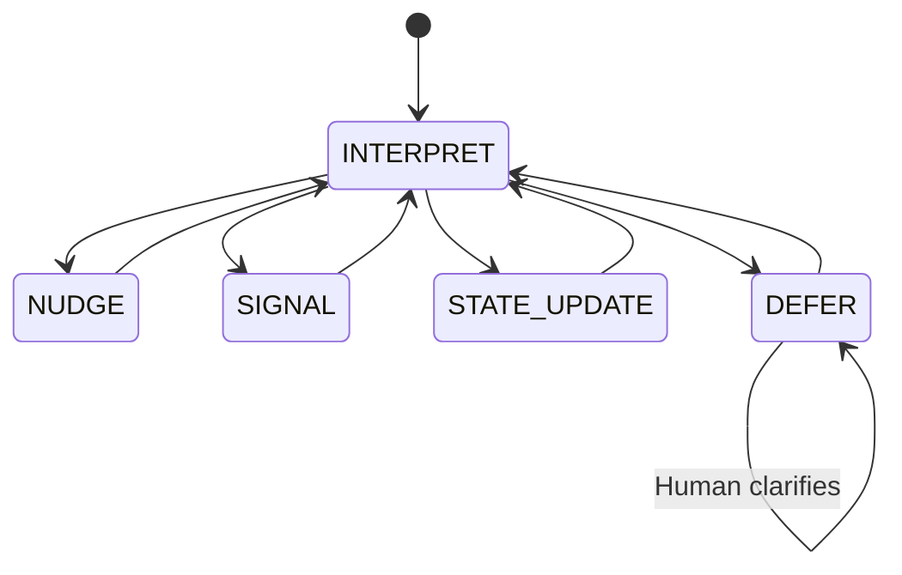
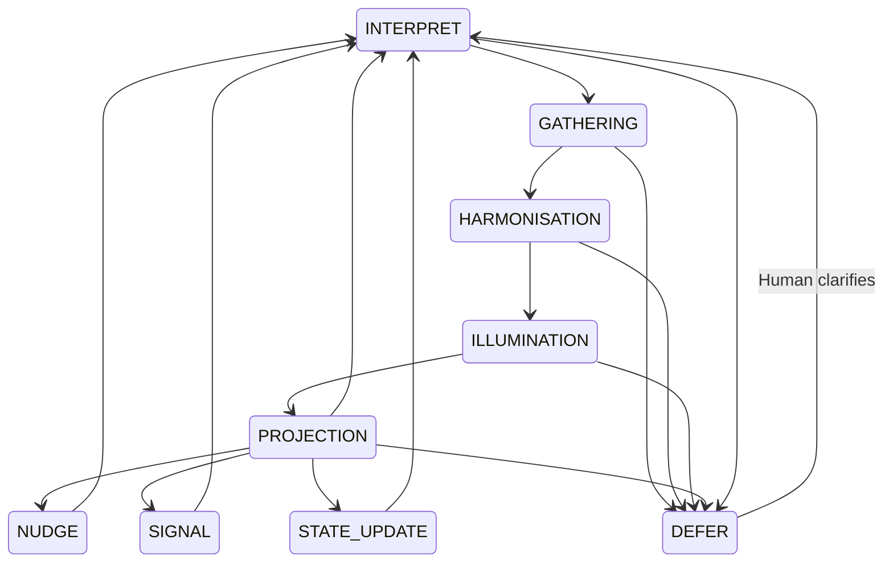

# CARE Runtime State Machine Diagrams  
*Evolution from Shii‑Cho form (Step 9) to full circular runtime loop (Steps 10–14).*

This document preserves the **historical Step 9 geometry** and introduces the **current full CARE runtime state machine**.  
Together, they show how CARE evolved from its foundational behavioural kata into a complete constitutional runtime.

---

# 1. Step 9 — Historical Behavioural Geometry  
*The Shii‑Cho form.*

This was the earliest runtime model: a minimal behavioural loop with constitutional safety.



## Notes (Step 9)

- All transitions are reversible except **DEFER → DEFER**, which persists until Human clarification.  
- Forbidden transitions (e.g., **NUDGE → SIGNAL**, **SIGNAL → NUDGE**, **STATE_UPDATE → SIGNAL**) are intentionally omitted.  
- **DEFER** is the constitutional safety valve and the only state requiring Human action to exit.  
- This diagram represents CARE’s **Shii‑Cho form** — the foundational geometry of its runtime behaviour.

---

# 2. Step 14 — Full CARE Runtime State Machine  
*The complete nine‑state circular loop.*

With Steps 10–14, CARE’s runtime expanded into a full constitutional cycle:

- **Inner Trilogy** (GATHERING → HARMONISATION → ILLUMINATION)  
- **Threshold** (PROJECTION)  
- **Behavioural Modes** (NUDGE / SIGNAL / STATE_UPDATE)  
- **Post‑Behavioural / Safety** (INTERPRET / DEFER)



---

## Notes (Steps 10–14)

- CARE now operates through **nine governed runtime states**.  
- The **Inner Trilogy** forms the inward arc; **PROJECTION** is the threshold; **BEHAVIOURS** form the outward arc.  
- Behaviour is only permitted when the invariant is stable, the stance is formed, and risk posture allows action.  
- **DEFER** remains the constitutional safety valve across all arcs.  
- This diagram represents the **mature runtime geometry** of CARE.

---

# Evolution Summary

```
Step 9      = behavioural geometry established  
Steps 10–12 = inner trilogy added  
Step 13     = projection threshold added  
Step 14     = behaviours formalised  
Current     = full circular runtime loop  
```

The repository now preserves both the **origin** and the **current form** of CARE’s runtime.
