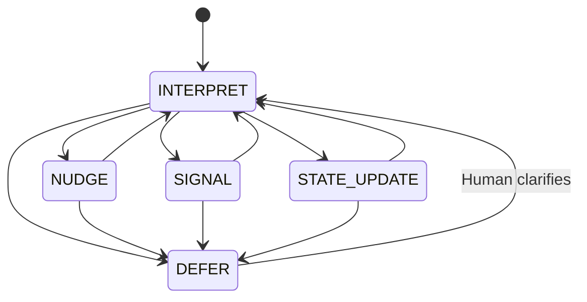

# CARE Runtime State Machine Diagram  
*Step 9 — Mermaid Representation*

This diagram expresses the governed movement of **[CARE](ca://s?q=Explain_the_role_of_CARE)** through its five runtime states using Mermaid’s state machine syntax.  
All transitions follow the constitutional rules defined in Step 9.

## Notes

- All transitions are **reversible**, except **DEFER → DEFER**, which persists until Human clarification.  
- Forbidden transitions (e.g., **NUDGE → SIGNAL**, **SIGNAL → NUDGE**, **STATE_UPDATE → SIGNAL**) are intentionally omitted.  
- **DEFER** is the constitutional safety valve and the only state that requires Human action to exit.  
- This diagram represents CARE’s **Shii‑Cho form** — the foundational geometry of its runtime behaviour.

