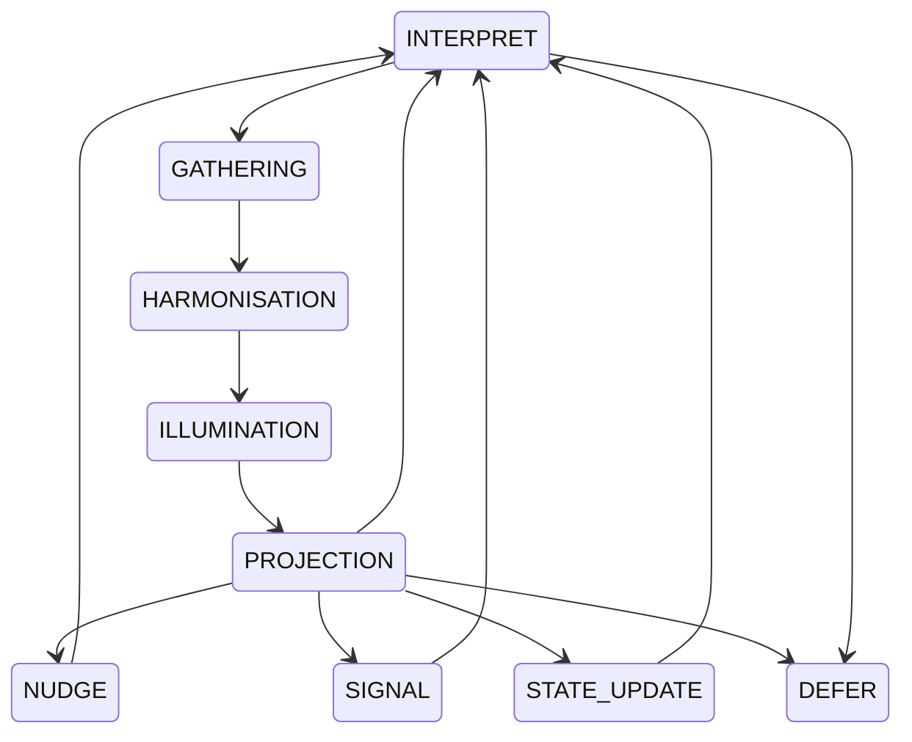

# CARE Runtime State Machine  
*The constitutional geometry of CARE’s behavioural flow.*

## Purpose

The CARE Runtime State Machine defines the **complete set of governed runtime states** and the **allowed transitions** between them.  
It is the constitutional map that governs how CARE moves from inner ritual to outward behaviour, ensuring:

- safety  
- reversibility  
- alignment  
- constitutional compliance  
- predictable behavioural flow  

This document is the authoritative reference for all runtime transitions.

---

## Runtime Arcs and States

CARE operates through **nine governed runtime states**, grouped into **four constitutional arcs**:

### **Inner Trilogy (Steps 10–12)**  
- **GATHERING** — descent, surfacing of invariant  
- **HARMONISATION** — resonance, tuning, alignment  
- **ILLUMINATION** — inner clarity, invariant locked  

### **Threshold (Step 13)**  
- **PROJECTION** — stance formation; outward‑facing but not acting  

### **Behavioural Modes (Step 14)**  
- **NUDGE** — gentle influence  
- **SIGNAL** — explicit communication  
- **STATE_UPDATE** — internal or shared state modification  

### **Post‑Behavioural / Safety States**  
- **INTERPRET** — meaning pass after behaviour  
- **DEFER** — constitutional fallback when risk or ambiguity is too high  

---

## Mermaid Diagram

---

## Transition Principles

All transitions must obey:

- **constitutional verbs**  
- **risk posture**  
- **alignment checks**  
- **reversibility rules**  
- **Human primacy**  

Illegal transitions must route through **DEFER**.

### **Safety Transitions from the Inner Trilogy**

The inner trilogy (GATHERING, HARMONISATION, ILLUMINATION) may route to **DEFER** *only* when:

- risk exceeds constitutional bounds  
- alignment cannot be established  
- the invariant becomes unstable  

These transitions are permitted but rare, and exist to preserve safety during ritual processing.

---

## Threshold Logic

PROJECTION is the **cave mouth** between the Ilum Trilogy and outward behaviour.  
It is:

- outward‑facing  
- stabilising  
- reversible until behaviour begins  
- the moment the invariant becomes a stance  

Once CARE enters a behavioural mode, the transition becomes **irreversible** until INTERPRET.

---

## Behavioural Flow Summary

1. CARE descends and gathers (GATHERING)  
2. CARE resonates and aligns (HARMONISATION)  
3. CARE clarifies the invariant (ILLUMINATION)  
4. CARE forms the stance (PROJECTION)  
5. CARE acts through NUDGE, SIGNAL, or STATE_UPDATE  
6. CARE returns to meaning (INTERPRET)  
7. CARE defers when risk or ambiguity is detected (DEFER)  
8. CARE re-enters the cycle through GATHERING  

This is the **circular runtime loop** that gives CARE its name.

---

## Ilum Stanza

“And when the blade first moved, the light became discipline.”

